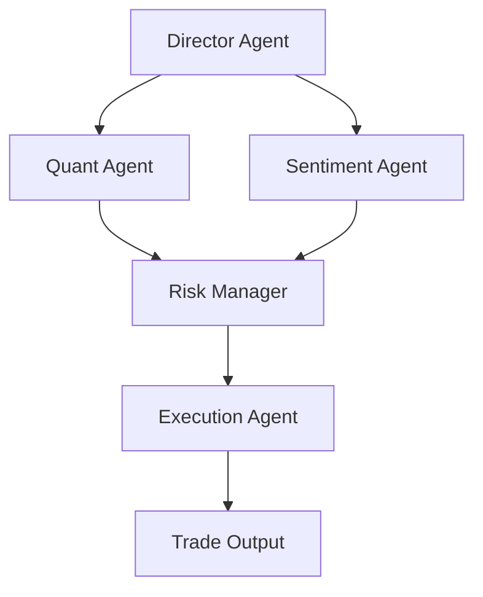

# AutoHedge 🚀

Build your autonomous hedge fund in minutes. AutoHedge harnesses the power of swarm intelligence and AI agents to automate market analysis, risk management, sentiment analysis, and trade execution.

## 🌟 Features

- **Multi-Agent Architecture**: Leverages specialized AI agents for different aspects of trading
  - **Director Agent**: Strategy formulation and thesis generation.
  - **Quant Agent**: Technical and statistical analysis.
  - **Risk Management Agent**: Position sizing and risk assessment.
  - **Sentiment Agent**: News and social media sentiment analysis.
  - **Execution Agent**: Trade implementation and order generation.

- **Real-Time Market Analysis**: Integrates with market data providers for live analysis.
- **Sentiment Analysis**: Evaluates market news to gauge investor sentiment.
- **Risk-First Approach**: Built-in risk management and position sizing.
- **Structured Output**: JSON-formatted trade recommendations and analysis.
- **Comprehensive Logging**: Detailed logging system for trade tracking and debugging.
- **Extensible Framework**: Easy to customize and extend with new capabilities.

## 📋 Requirements

- Python 3.10+
- `swarms`
- `tickr-agent`
- `swarm-models`
- `langchain-community`, `langchain-openai`
- Additional dependencies listed in `requirements.txt`

## 🚀 Quick Start

### Installation

1. Clone the repository:
   ```bash
   git clone https://github.com/The-Swarm-Corporation/AutoHedge.git
   cd AutoHedge
   ```

2. Install dependencies:
   ```bash
   pip install -r requirements.txt
   ```

### Configuration

Create a `.env` file or set environment variables:

```bash
OPENAI_API_KEY="your_openai_key"
GROQ_API_KEY="your_groq_key" # Optional, if using Groq models

# Optional Configuration
DIRECTOR_MODEL="groq/deepseek-r1-distill-llama-70b"
SENTIMENT_MODEL="gpt-4o-mini"
MAX_LOOPS=1
```

### Basic Usage

```python
# Example usage
from autohedge.main import AutoHedge

# Define the stocks to analyze
stocks = ["NVDA", "AAPL"]

# Initialize the trading system
trading_system = AutoHedge(stocks)

# Define the task
task = "Analyze curent market conditions and propose trades."

# Run the trading cycle
results = trading_system.run(task=task)
print(results)
```

## 🏗️ Architecture

AutoHedge uses a modular multi-agent architecture:



### Agent Roles

1. **Director Agent**
   - Generates trading theses
   - Coordinates overall strategy
   - Analyzes market conditions

2. **Sentiment Agent**
   - Analyzes financial news
   - Evaluates social sentiment
   - Identifies key market themes

3. **Quant Agent**
   - Performs technical analysis
   - Evaluates statistical patterns
   - Calculates probability scores

4. **Risk Manager**
   - Assesses trade risks
   - Determines position sizing
   - Sets risk parameters

5. **Execution Agent**
   - Generates trade orders
   - Sets entry/exit points
   - Manages order execution

## 📊 Output Format

AutoHedge generates structured output using Pydantic models, including:
- **Thesis**: Market view and strategy.
- **Sentiment**: News analysis summary.
- **Quant Analysis**: Technical scores.
- **Risk Assessment**: Sizing and drawdown limits.
- **Order**: Specific trade instructions.

## 📝 Logging

Logs are written to `logs/autohedge.log` using `loguru`.

## 📜 License

This project is licensed under the MIT License - see the [LICENSE](LICENSE) file for details.
